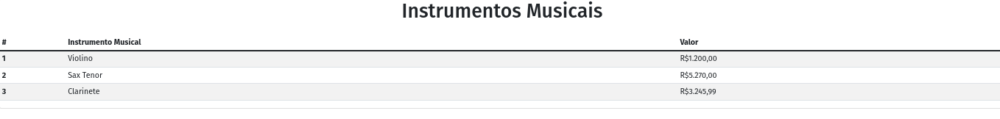

# Pequeno Projeto em Next.js

 1. Criar um projeto em next
 ```
npx create-next-app next-started
 ```
 2. Criar o diretório pages/instrumentos e dentro o arquivo index.js | Objetivo: compreender o sistema de rotas.
 ```
// Para acessar o componente somente digite no browser /nomedodiretoriocriado
http://localhost:3000/instrumentos
 ```

 3. Instalar o bootstrap
 ```
npm install bootstrap --save
 ```
No arquivo _app.js
```
import 'bootstrap/dist/css/bootstrap.css'
```

4. Resultado final com algumas classes do bootstrap incorporadas
